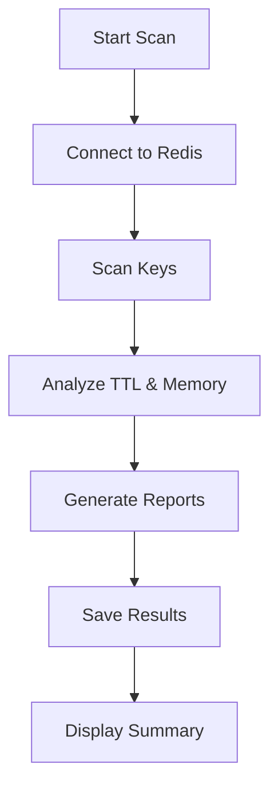
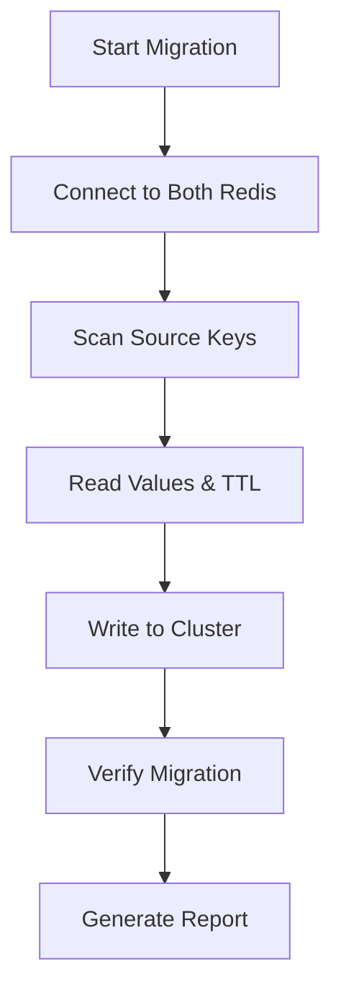
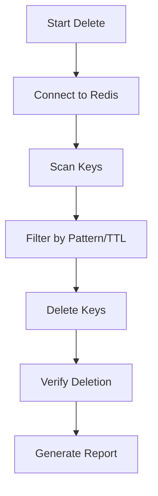
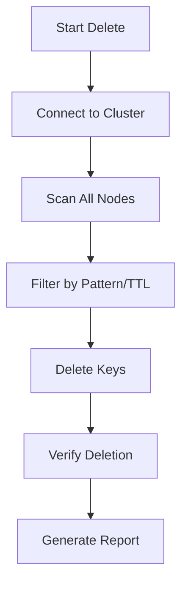

# Redetective

[](https://choosealicense.com/licenses/mit/)

A command-line utility for analyzing Redis keys, migrating data between Redis instances, and managing Redis keys in both standalone and cluster environments.


## Prerequisites

- Node.js LTS (v18.17.0 or higher)
- PNPM package manager
- Redis instance (standalone and/or cluster)

## Setup

1. Install Node.js LTS from [nodejs.org](https://nodejs.org/)

2. Install PNPM:

```bash
curl -fsSL https://get.pnpm.io/install.sh | sh -
```

3. Clone the repository and install dependencies:

```bash
git clone https://github.com/Abhinav-birdeye/redis-scanner.git
cd redis-scanner
pnpm install
```

4. Create a `.env` file based on `.env.local`:

```bash
cp .env.local .env
```

5. Configure your Redis connections in `.env`:

```env
# Standalone Redis
REDIS_HOST=your-redis-host
REDIS_PASSWORD=your-password
REDIS_DB=0
REDIS_PORT=6379

# Redis Cluster
REDIS_CLUSTER_HOST=your-cluster-host
REDIS_CLUSTER_PASSWORD=your-cluster-password
REDIS_CLUSTER_PORT=6379
```

## Usage

Start the CLI program:

```bash
pnpm start
```

### Available Commands

The utility provides four main functions:

1. **Scan Standalone DB**

```bash
pnpm scan
```



2. **Migrate from Standalone to Cluster**

```bash
pnpm migrate
```



3. **Delete Keys from Standalone**

```bash
pnpm delete
```



4. **Delete Keys from Cluster**

```bash
pnpm delete:cluster
```



### Features

- **Scanning**: Analyzes Redis keys, their TTL, and generates reports
- **Migration**: Moves data from standalone Redis to Redis Cluster
- **Deletion**: Safely removes keys from either standalone or cluster Redis
- **Batch Processing**: Handles operations in batches to prevent memory overload
- **Error Handling**: Graceful error handling and logging
- **Reports**: Generates detailed reports in both JSON and TXT formats

### Output Files

Reports are generated in the `result/db{N}/` directory:

- `{N}-keys-older-{days}-days.txt`: List of old keys
- `{N}-keys-no-ttl.txt`: Keys without TTL
- `{N}-keys-older-{days}-days.json`: Detailed old keys info
- `{N}-keys-no-ttl.json`: Detailed no-TTL keys info

## Development

- Format code:

```bash
pnpm format
```

- Lint code:

```bash
pnpm lint
```

## Environment Variables

| Variable               | Description               | Default |
| ---------------------- | ------------------------- | ------- |
| REDIS_HOST             | Standalone Redis host     | -       |
| REDIS_PASSWORD         | Standalone Redis password | -       |
| REDIS_DB               | Redis database number     | 0       |
| REDIS_PORT             | Standalone Redis port     | 6379    |
| REDIS_CLUSTER_HOST     | Redis Cluster host        | -       |
| REDIS_CLUSTER_PASSWORD | Redis Cluster password    | -       |
| REDIS_CLUSTER_PORT     | Redis Cluster port        | 6379    |

## License

MIT
